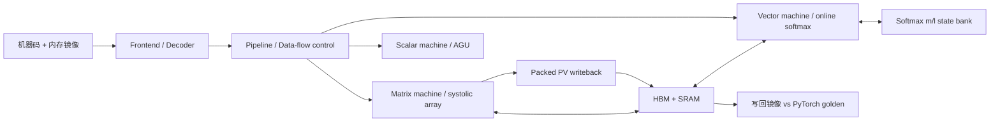

# PLENA Hardware

面向长上下文 LLM Prefill 的可编程 NPU RTL 工程。默认根目录是 RTL-v6 研究快照，包含矩阵/向量/标量机器、存储与控制、四行 Online Softmax 和 packed PV 路径，以及配套 Compiler、Tools、cocotb 测试、构建与综合脚本。

公开 RTL 基线在 [reference/upstream-release](reference/upstream-release)，带自己配套的 Compiler/Tools。两套工程完整内嵌，普通 `git clone` 即可浏览。软件与系统研究：[plena-software](https://github.com/Sanssssssssssssssss/plena-software)。

## 架构与目录



| 路径 | 职责 / 输入输出 |
|---|---|
| [src/frontend](src/frontend) / [src/control](src/control) | 指令解码、循环、hazard、DMA 控制 |
| [src/matrix_machine](src/matrix_machine) | 低精度矩阵计算与 packed PV 输出 |
| [src/vector_machine](src/vector_machine) | 向量运算、规约、m/l 递推状态与多行 softmax |
| [src/memory](src/memory) / [src/scalar_machine](src/scalar_machine) | HBM/SRAM 和标量地址/控制运算 |
| [src/definitions](src/definitions) | ISA、精度、tile/SRAM 参数；运行前核对 |
| [src/system](src/system) / [tools](tools) | 顶层测试平台、工作负载生成、Verilator 与 Synopsys 入口 |
| [PLENA_Compiler](PLENA_Compiler) / [PLENA_Tools](PLENA_Tools) | 快照配套的汇编、机器码、量化与验证工具 |
| [reference/upstream-release](reference/upstream-release) | 独立公开基线与其两项内嵌依赖 |
| [scripts](scripts) / [evidence](evidence) | 两套可复跑入口 / 历史和本轮日志 |

## 安装与最小运行

Linux/WSL，Python 3.12、g++、make、Perl。Verilator 5.34.0、cocotb 1.9.2；全程 CPU。

```bash
git clone https://github.com/Sanssssssssssssssss/plena-hardware.git
cd plena-hardware
python3 -m venv .venv
.venv/bin/pip install -r requirements-rtl.txt
bash scripts/run_rtl.sh modules
```

`modules` 顺序构建并检查四行 Softmax（2 项）和 packed PV（1 项），输出 `runs/modules/` 日志、XML、计时 JSON。脚本检查新的 XML，runner 退出 0 但用例失败也会报错；不复用旧 XML 判成功。PyPI Verilator wheel 的 GCC PCH 配置由入口局部补齐，构建限制 4 个任务。

公开基线小 Linear 使用原 `just rtl-sim` 流程；安装 `just` 后运行：

```bash
bash scripts/run_rtl.sh baseline
```

固定 `(4,16) @ (16,32)`、seed 42，生成汇编/158 个机器码字、HBM/SRAM 镜像与 golden，再仿真比较写回。产物在 `reference/upstream-release/build/test/linear/`，日志/收据在 `runs/baseline/`。入口在结束时恢复生成器修改的指令偏移配置。安装 `just` 和更多原生入口见 [SETUP](docs/SETUP.md)。

[本轮验收与日志](docs/VALIDATION.md)给出实际状态。数值比较沿用上游容差与门槛，不因整理项目而放宽。

## 两个版本如何使用

默认快照：RTL `1e0eb060` / Compiler `17b2bd09` / Tools `af11f546`。公开基线：RTL `783ee48e` / Compiler `d89ad594` / Tools `0f103539`。[版本配套表](docs/COMPATIBILITY.md)列出与研究软件的关系。

模块测试显式使用 R4；顶层默认行数不应被误读为 R4。快照的模块验证与公开基线的 full-core Linear 是两个独立结论。尚未认证研究编译器在任意 profile 上的 full-model 执行。运行入口保留原有 machine code、memory、golden 和 verification 格式。

## 与项目描述对应的重点

| 主线 | 本仓库的实际入口 |
|---|---|
| 编译映射 | 基线 Linear 生成器：量化 → 存储布局 → DMA/汇编 → 机器码 → golden |
| RTL 优化 | state bank/state SIMD/row engine、packed PV writeback/accumulator；[核心注释索引](docs/READING.md) |
| 联合搜索 | 综合脚本与结构参数是软件成本模型的输入；校准结果和 DSE 源码在软件仓库 |
| 系统评估 | RTL 功能约束成本模型；系统吞吐和能效由软件中的服务模型计算 |

[实施阶段与瓶颈判断](docs/PROJECT_JOURNEY.md)串联上述路径。简历的 2.69×/3.22× 等为历史模型研究结果，其条件与证据缺口见 [软件成绩核对](https://github.com/Sanssssssssssssssss/plena-software/blob/main/docs/RESULTS.md)，不能用当前 tiny RTL 测试直接证明。

## 来源与验证边界

本仓库保留源码版权头、公开基线的 LICENSE/第三方声明，记录归档 SHA256 与每项导入 commit。见 [PROVENANCE](PROVENANCE.md)。45 处注释直接位于实际源码；其余 43 处在软件仓库。

历史包的 17 份 XML 共 29 个 testcase，含 4 项失败，保留为历史证据。本轮不会将它们改标为通过。未重跑 DC 综合、完整 RTL 回归、GPU 或完整 DSE；综合还需要相应工具许可及工艺库。
