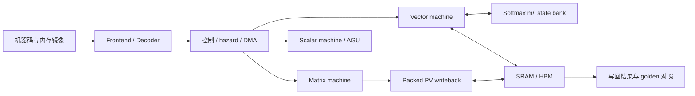

# PLENA Hardware · Qwen3 Prefill

**Qwen3-32B / 235B-A22B · 四行 Online Softmax · packed PV · RTL 验证**

面向从 Llama 迁移到 Qwen3-32B / 235B-A22B 后的 Prefill 工作负载，围绕状态搬运、Softmax 并行度和 PV 输出整形优化 [PLENA](https://github.com/AICrossSim/PLENA) 数据通路。重点包括 m/l 状态驻留、四行 Online Softmax、地址依赖检查与 packed PV 累加写回。

根目录为 RTL-v6，公开基线位于 `reference/upstream-release`；两套工程各自保留 Compiler、Tools 和测试资源。模型迁移、量化与设计空间搜索在配套软件仓库。

[软件工程](https://github.com/Sanssssssssssssssss/plena-software) · [核心源码索引](docs/READING.md) · [验证结果与日志](docs/VALIDATION.md) · [安装说明](docs/SETUP.md)

## 项目结果

在相同精度和阵列配置下，Qwen3 Dense / MoE 长上下文单层模型性能提升 **2.69× / 3.22×**。主要实验在另一台计算机完成，采用项目最终报告中的成绩。

系统评估使用 **W4/A4/KV4、90k 输入 / 8k 输出、batch 8**。匹配硅面积与 HBM 预算后，相对纯 A100 基线，稳态输出吞吐提升 **5.3% / 13.3%**，输出能效提升 **46.8% / 65.0%**。系统指标由 NPU 性能模型与 A100/vLLM 测量共同计算；配置与结果来源见[软件项目结果](https://github.com/Sanssssssssssssssss/plena-software/blob/main/docs/RESULTS.md)。

本机保存的 Softmax、packed PV 与小 Linear 测试用于检查功能，详见下方“本机复测”。

## 架构与源码



| 核心路径 | 职责 |
|---|---|
| [frontend](src/frontend) / [control](src/control) | 解码、循环、hazard 与 DMA 控制 |
| [matrix_machine](src/matrix_machine) | 低精度矩阵计算、packed PV 累加与写回 |
| [vector_machine](src/vector_machine) | 向量运算、规约、递推状态与多行 Softmax |
| [memory](src/memory) / [scalar_machine](src/scalar_machine) | 存储、标量运算与地址生成 |
| [definitions](src/definitions) / [system](src/system) | ISA、精度、tile/SRAM 配置与顶层测试 |
| [Compiler](PLENA_Compiler) / [Tools](PLENA_Tools) | 快照配套的指令生成、镜像与数值比较 |
| [公开基线](reference/upstream-release) / [运行脚本](scripts) | 独立基线工程 / 模块与 Linear 运行入口 |

## CPU 最小运行

Linux/WSL、Python 3.12、g++、make、Perl；验证使用 Verilator 5.34.0 与 cocotb 1.9.2。

```bash
git clone https://github.com/Sanssssssssssssssss/plena-hardware.git
cd plena-hardware
python3 -m venv .venv
.venv/bin/pip install -r requirements-rtl.txt
bash scripts/run_rtl.sh modules
```

模块日志、XML 与计时 JSON 写入 `runs/modules/`。安装 `just` 后运行公开基线 Linear：

```bash
bash scripts/run_rtl.sh baseline
```

生成汇编、机器码、内存镜像和 golden，随后仿真并比较写回。日志位于 `runs/baseline/`；工具安装及原生构建/综合入口见 [SETUP](docs/SETUP.md)。

## 本机复测

| 版本与路径 | 结果与条件 |
|---|---|
| RTL-v6 四行 Softmax | 2 项模块测试通过 |
| RTL-v6 packed PV | 1 项模块测试通过 |
| 公开基线小 Linear | 生成 158 个机器码字；**128/128** 个输出在既定容差内通过 |
| 本仓库新增 | 两套运行脚本、45 处核心源码注释、配置说明与测试日志 |

以上为 **2026-10-04 的本机验证结果**。Softmax/PV 模块测试与公开基线 Linear 是不同版本的独立验证。Linear 使用 `(4,16) @ (16,32)`、seed 42；容差为 `|err| ≤ 0.1 + 0.1|golden|`。[完整条件与日志](docs/VALIDATION.md) · [日志目录说明](evidence/README.md)。

## 从哪里读代码

| 重点 | 从这里开始 |
|---|---|
| 张量如何落到机器码与内存地址？ | [Linear 生成器](reference/upstream-release/tools/testworkloads/linear.py)与[源码索引](docs/READING.md) |
| Softmax 如何处理状态依赖与同拍接受？ | [row engine](src/vector_machine/rtl/softmax_row_engine.sv)与[模块测试](src/vector_machine/test/softmax_row_engine_tb.py) |
| packed PV 怎样对齐接受、累加与最终提交？ | [writeback](src/matrix_machine/rtl/packed_pv_writeback.sv)与[accumulator](src/matrix_machine/rtl/packed_pv_accumulator.sv) |
| 如何提出假设并用证据排查瓶颈？ | [项目阶段与验证思路](docs/PROJECT_JOURNEY.md) |

## 配套版本与来源

快照：RTL `1e0eb060` / Compiler `17b2bd09` / Tools `af11f546`。公开基线：RTL `783ee48e` / Compiler `d89ad594` / Tools `0f103539`。跨版本组合见[配套表](docs/COMPATIBILITY.md)。

PLENA 基础框架及第三方模块保留原有版权声明。仓库整理另补充中文注释、运行脚本与本机测试日志。[来源与改动](PROVENANCE.md)记录版本、归档哈希和第三方声明。DC 综合、完整 RTL 回归、上板与 GPU 评测未包含在上述验证中；历史模型成绩见[软件结果核对](https://github.com/Sanssssssssssssssss/plena-software/blob/main/docs/RESULTS.md)。
