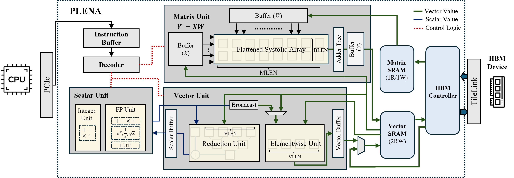

# PLENA RTL Implementation



This repository contains the SystemVerilog RTL for **PLENA (Programmable
Long-context Efficient Neural Accelerator)**, together with a cocotb/Verilator
test harness for running full-system simulations and a Synopsys flow for
synthesis.

---

## Setup

There are two ways to get a working environment. **Option A (Docker)** is the
recommended path — you only need Docker installed, and it wraps the full RTL
toolchain (Verilator, cocotb, Python deps) in a reproducible container. **Option
B (Nix)** runs directly on your machine if you prefer native development.

### Option A — Docker (recommended)

You only need Docker installed (no Nix or direnv on the host). All commands run
from the repository root. Your working tree is bind-mounted into the container at
`/workspace`, so edits on the host are picked up live and simulation artifacts
persist back in your working tree.

**Prerequisites:**

- Docker Engine with the Compose plugin (`docker compose`)
- `just` on the host (or call `docker compose …` directly — see below)

**Build the image and open a shell:**

```bash
git submodule update --init --recursive   # once, on the host (pulls PLENA_Tools, PLENA_Compiler)
just docker-build                         # build the dev image
just docker-dev                           # build (if needed) and drop into a shell
```

The first build compiles Verilator from source (pinned to the version
`flake.nix` resolves to, default `5.034`) — a one-time cost of a few minutes. The
Python venv and ccache live in named volumes, so later runs are fast.

**Run a recipe directly (no interactive shell needed):**

```bash
just docker-test rtl-sim linear          # generate the linear workload + run the sim
just docker-test test-hw                 # FP hardware cocotb tests
just docker-test rtl-lint                # Verilator lint
```

`docker-test` forwards the recipe name and its arguments verbatim, so multi-word
invocations and per-workload flags work (see [Running simulations](#running-simulations)).

**Common Docker commands** (see [`docker/README.md`](docker/README.md) for the full list):

| Command | Description |
|---------|-------------|
| `just docker-build` | Build the dev image |
| `just docker-dev` | Build (if needed) and enter an interactive shell |
| `just docker-run <cmd>` | Run an arbitrary command in the dev image |
| `just docker-test <recipe> [args...]` | Run a `just` recipe in the dev image |
| `just docker-clean` | Remove containers and cache volumes |

Equivalent raw compose commands, if you don't have `just` on the host:

```bash
docker compose -f docker/docker-compose.yml build dev
docker compose -f docker/docker-compose.yml run --rm dev bash
docker compose -f docker/docker-compose.yml run --rm dev just rtl-sim linear
```

**GPU:** not needed. Simulations run on the CPU and PyTorch is only used for
golden models and quantisation, so the default image installs the CPU build of
torch. The `cuda` compose profile (`dev-cuda`) only adds the NVIDIA runtime; see
[`docker/README.md`](docker/README.md) if you want to swap in a CUDA torch.

### Option B — Nix (native)

This project uses [direnv](https://direnv.net/) with Nix flakes for a native
environment.

**Prerequisites:**

- `nix` package manager (with flakes enabled)
- `direnv` for environment management

```bash
# Install the direnv hook in your shell (once)
echo 'eval "$(direnv hook bash)"' >> ~/.bashrc
source ~/.bashrc
```

**Installation:**

```bash
git submodule update --init --recursive   # pull PLENA_Tools, PLENA_Compiler

# Allow direnv to load the environment. The .envrc will automatically:
#   - set up a Python 3.12 virtual environment
#   - install PyTorch, cocotb, numpy, and other dependencies
#   - install the local packages PLENA_Tools and PLENA_Compiler
direnv allow

# (Or enter the toolchain shell manually)
nix develop
```

You are now in a shell with the full toolchain (Verilator, Python 3.12, cocotb,
etc.) and can run any of the `just` recipes below directly.

#### Manual installation (no direnv/Nix)

If you have Verilator on your `PATH` already and just want the Python deps:

```bash
python3.12 -m venv .venv
source .venv/bin/activate
pip install -e .              # installs the pinned Python dependencies (setup.py)
pip install -e PLENA_Tools
pip install -e PLENA_Compiler
```

See [`PLENA_Tools/README.md`](PLENA_Tools/README.md) for details on the tools package.

---

## Running simulations

Full-system RTL simulations are driven by the `rtl-sim` recipe, which (1)
generates a workload, (2) runs it through the cocotb/Verilator harness, and
(3) verifies the result against a golden reference.

```
just rtl-sim <workload> [rebuild=true|false] [--args...]
```

- `<workload>` — one of the generators in `tools/testworkloads/`:
  layers `linear`, `rms_norm`, `silu`, `linear_silu`, `silu_down`, `softmax`,
  `rope`, `mha`, `gqa`, `attention`, `ffn`, `llama_layer` (a full Llama decoder
  layer); infrastructure tests `prefetch`, `loop`, `scratchpad`. Every generator
  has defaults derived from the hardware tile sizes, so `just rtl-sim <name>`
  runs without arguments. See [`doc/design/workload_matrix.md`](doc/design/workload_matrix.md)
  for the verified shapes and match rates.
- `rebuild` — `true` (default) recompiles the RTL with Verilator; `false` reuses
  the cached build (much faster when only the workload data changes). The flag is
  positional, so you must give it explicitly before any `--args`.
- `--args...` — forwarded to the workload generator (see below).

Inside Docker, prefix with `docker-test`:

```bash
just docker-test rtl-sim linear                 # defaults: batch=8, in=128, out=256, rebuild RTL
just docker-test rtl-sim linear false           # reuse cached RTL build
just docker-test rtl-sim linear true --batch 16 # force rebuild with a custom batch
```

### Workload and compute dimensions (linear example)

The **workload** dimensions are CLI arguments to the generator
(`tools/testworkloads/linear.py`):

| Arg | Default | Constraint |
|---|---|---|
| `--batch` | 8 | must be divisible by `BLEN` |
| `--in-features` | 128 | must be divisible by `MLEN` |
| `--out-features` | 256 | must be divisible by `MLEN` |
| `--seed` | 42 | RNG seed |
| `--mx-format {mxfp,mxint}` | unset → follows `precision.svh` (`ACT_MX_INT_ENABLE`) | quantization format |
| `--use-aten-compiler` | off (uses the `projection_asm` template) | emit ISA via the ATen `PlenaCompiler` |

```bash
# Custom workload size, ATen compiler path, reusing the cached RTL build:
just docker-test rtl-sim linear false \
    --batch 16 --in-features 256 --out-features 512 --use-aten-compiler
```

The **compute** dimensions are the hardware tile sizes baked into the RTL, set in
[`src/definitions/configuration.svh`](src/definitions/configuration.svh):

```
BLEN = 4    // vector/batch tile   → batch / seq_len must be a multiple of this
MLEN = 8    // matrix tile         → in/out features must be multiples of this; head_dim == MLEN
VLEN = 8    // vector length       → kv_len == VLEN for the attention workloads
HLEN = 8
```

The generator reads these from the SVH at runtime and asserts your workload dims
are divisible by them. Changing the compute dimensions means editing
`configuration.svh` and rebuilding (`rebuild=true`), since it changes the
hardware.

---

## Other test recipes

| Recipe | Description |
|---|---|
| `just rtl-suite [rebuild]` | Layer suite (`tools/testworkloads/test_suite.py`): one Verilator build, every case reloaded and verified in a loop |
| `just test-hw` | FP arithmetic hardware cocotb tests (`fp_ieee_*`, `fp_cp_*`, `fp_fix_*`) |
| `just test-fp` | FP arithmetic unit tests (custom RTL path, no DesignWare) |
| `just rtl-lint [--strict]` | Verilator lint (what CI runs) |
| `just rtl-check [module]` | RTL elaboration + C++ build check (default `SimTop`) |
| `just rtl-sim-clean [workload]` | Remove `build/test/<workload>` |

Aliases: `th` → `test-hw`, `sim` → `rtl-sim`, `syn` → `synth`.

Notes:

- Set `SIMTOP_TRACE=0` to skip waveform generation (much faster; the default
  writes `build/test/<workload>/dump.vcd`).
- Workload generators patch `INSTRUCTION_STORAGE_OFFSET` in
  `src/definitions/configuration.svh` to place the program after the data, so
  `git status` shows that file modified after a run. Do not commit that hunk
  (`git checkout -- src/definitions/configuration.svh`). Because the offset is
  baked into the build, `rebuild=false` is only valid when the workload and its
  shape did not change.
- Runs share one Verilator build directory; do not run two `rtl-sim`s at once.
- Verification passes at ≥ 90 % of elements within `|err| ≤ 0.1 + 0.1·|golden|`
  (`PLENA_Tools/verification/verify_rtl_sim.py`).
- See [`AGENTS.md`](AGENTS.md) for repository conventions and
  [`doc/testing.md`](doc/testing.md) for the test infrastructure.

---

## Synthesis (native only)

```bash
just synth <module> [clk_period_ps] [compile_mode]
# e.g. just synth fp_adder 500 ultra
```

> **Note:** `just synth …` needs a licensed Synopsys Design Compiler. Point
> `SYNOPSYS_SETUP` at your site's DC environment script (the default is an
> institutional path) and provide the ASAP7 library under
> `tools/synopsys/lib/asap7` (not shipped). Builds with `DC_LIB_EN` additionally
> need Synopsys DesignWare FP IP. Synthesis is **not** available in Docker.
> See [`tools/synopsys/README.md`](tools/synopsys/README.md).

---

## License

PLENA is released under the [Apache License 2.0](LICENSE). Vendored
third-party components (lowRISC/OpenTitan primitives, Gary Guo's TileLink
library) keep their own licenses; see
[`THIRD_PARTY_LICENSES.md`](THIRD_PARTY_LICENSES.md).
